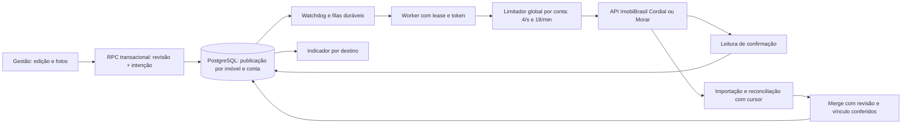

# Recuperação automática ImobiBrasil — Cordial e Morar

Revisão de 22/09/2026. Base remota reconfirmada: `origin/main` em `62a1f38`. Este documento descreve o código desta PR e o que precisa ser verificado no ambiente antes de aplicar. Não houve acesso ao banco, Vault, crons, deploy nem aos anúncios de teste reais nesta execução.

## Fluxo e invariantes



1. A identidade é `(property_id, provider)`; `external_property_id` e os códigos de pessoas pertencem exclusivamente à conta. Foto local tem `image_id` estável; vínculo remoto pertence à publicação.
2. `properties.revision` e `properties.gallery_revision` são monotônicas e independentes. Revisão desejada, processada e confirmada são estados diferentes. Só a leitura remota suficiente avança confirmação.
3. Mudança local e intenção ficam na mesma transação. O HTTP que acorda o worker é opcional. `property_sync_recover_intents` recupera intenção de mídia sem job, falhas recuperáveis e leases vencidos com lote limitado.
4. `changed_fields = NULL` significa envio completo, `{}` nenhum campo remoto e lista não vazia envio parcial. A coalescência preserva `NULL` e a união das listas ainda pendentes, inclusive de job falho.
5. O token e a validade do lease condicionam conclusão. Trabalhador tardio não confirma job alheio. Criação, exclusão e mídia usam também versão da decisão de disponibilidade; foto não cria imóvel e imóvel oculto/excluído não recebe nova mídia.
6. `delivery_unknown` e leitura remota não confiável nunca equivalem a `synced`. Sem ID de foto retornado ou identidade verificável, o upload fica inconclusivo e não sofre outro POST cego.
7. Remoção pendente continua fora da galeria ativa, mas conserva original/derivados e vínculo até a confirmação da exclusão em cada conta. Capa e ordem são calculadas apenas com fotos ativas, inclusive quando `pending_remote_delete` legado é `NULL`. A variante desejada da marca segue Cordial, Morar ou ambas e fica gravada na foto; o scanner reprocessa gradualmente derivadas legadas divergentes sem disparo em massa.
8. A API documentada expõe inserção, lista e exclusão de imagens; não foi encontrado endpoint de ordem/capa. A reconstrução usa checkpoint antes de cada efeito, releitura depois, passos limitados por deadline e preserva prefixo conhecido. A API não dá atualização atômica da galeria: um estado intermediário no site pode ser visível durante a reconstrução.
9. `WATERMARK_VERSION` em TypeScript e `property_expected_watermark_hash` em SQL precisam avançar juntos em uma migração quando o template mudar. Aderência à variante é verificada antes de a foto entrar no conjunto publicável.

## Diagnóstico: achado → evidência → correção → verificação

| Achado reconfirmado no código base | Correção integrada | Evidência executada |
| --- | --- | --- |
| `queueMedia` podia engolir erro e perder o job; kick não era garantia | Gatilho de `gallery_revision` grava `media_dirty_revision` e enfileira na transação; watchdog recupera lacuna | Testes da política e leitura da migração; PostgreSQL real pendente |
| Reconstrução exigia janela impossível de 140 s dentro do orçamento de 110 s | Plano e operação persistidos antes de delete/POST; continuação por execução; não inicia upload com menos de 95 s | Testes de galeria e simulador HTTP; queda real entre API e commit pendente |
| Job incompleto podia terminar `succeeded` e `delivery_unknown` podia ser reenviado | Sucesso apenas em `synced`/cadastro confirmado; desconhecido fica em recuperação espaçada; foto ativa sem derivada não confirma galeria | 333 testes TS, incluindo ambiguidade e estados |
| A/B: snapshot anterior podia atribuir código de A a B; heurística da única foto livre | Associação apenas pelo código retornado para a operação e localizado em releitura; sem prova, bloqueio explícito | Testes de planner; integração com 2 uploads reais pendente |
| Revisão esperada não percorria todo o fluxo de fotos | RPCs de ordem/capa/exclusão/substituição recebem revisão; movimento por ID e âncoras sofre rebase limitado | `gallery-move.test.ts`, fixture 17 ativas + pendente |
| Substituição expunha foto nova antes da troca da antiga | Original novo é registrado como estágio invisível; ativação, tombstone, capa, ordem e intenção na mesma transação | Typecheck e testes puros; teste PostgreSQL pendente |
| Marca dependia de reprocessamento no navegador e forçava variante combinada | Original registrado e job de imagem recuperável no servidor; variante por destino e hash desejado persistidos; worker antigo não confirma após troca | Teste puro de variantes e fixture SQL de troca de destino; runtime real pendente |
| Checkpoint da galeria era condicionado ao lease, mas vínculo de foto ainda aceitava gravação direta | RPC de vínculo valida token, revisão, publicação e identidade dentro da gravação | Fixture SQL com token errado, válido e vencido; concorrência em Supabase real pendente |
| Merge de importação permitia patch vazio sem verificar revisão/vínculo | RPC verifica revisão local, ID/provedor/código/`updated_at` de ambas as contas e grava patch, snapshot, conflito e contador juntos | Testes de política de importação; PostgreSQL real pendente |
| Base `confirmed_field_snapshot` não avançava após envio | Só campos confirmados por leitura avançam; snapshot remoto observado é gravado separado | `confirmed-local-fields.test.ts` |
| `sameValue` equiparava números ambíguos | Normalização por campo/origem; identificadores são texto, dinheiro usa centavos, área preserva precisão | `number-compare.test.ts`, `payload-diff.test.ts` |
| Ausência de cron cadastral/mídia versionado e URLs antigas | Migração idempotente troca apenas os crons da integração; origem e segredo vêm do Vault, com saúde de despacho | SQL versionado; crons ativos, URL e HTTP em produção pendentes |
| Chave pública podia ser aceita como segredo de worker | `hook-auth` só aceita segredo de servidor; chave publicável é recusada mesmo se configurada por engano | `hook-auth.test.ts` |
| Varredura limitada podia prender registros fora das primeiras páginas | Recuperação por filtros e vencimento no PostgreSQL, lote com `SKIP LOCKED`; agendamento redundante de image retry removido | Revisão da query; comportamento em backlog real pendente |
| Pause/configuração de escrita podia falhar aberta | Leitura ausente, inválida ou com erro bloqueia escrita sensível | Caminho de erro no worker; falha real de configuração pendente |
| Edição passava destinos lidos antes da transação e `[]` virava escopo completo | RPC deriva publicações habilitadas sob a trava do imóvel, preserva `NULL` versus `{}` e exige perfil de edição | Fixture SQL: destino fornecido vazio ainda gera job; lista de campos vazia não gera envio |
| Criação podia reiniciar com a mesma trava após troca de lease ou cair antes do checkpoint | Trava usa token da execução; intenção de criação é gravada antes do POST; retirada reconcilia criação ambígua antes de concluir | Fixture SQL: token incorreto, checkpoint anterior ao efeito, edição concorrente |
| Ocultar/excluir gravava a publicação fora da trava do job e a intenção local fora da outbox | RPC transacional registra decisão, revisão e jobs por conta; confirmação final exige lease e versão da intenção | Fixture SQL: worker tardio não desfaz publicação nova; exclusão registra job junto da decisão |
| Importação encerrava jobs por ID e dependia de início manual | Finalização usa token do lease; cron diário semeia ciclo incremental por conta, sem duplicar ciclo ativo | Fixture SQL: dois seeds Cordial geram um ciclo; Morar inicia independentemente |
| Leitura de imagem com código desconhecido ou página curta podia confirmar ausência | Parser recusa item sem identidade, exige fim da paginação e não descarta linha desconhecida | Testes `image-ops.test.ts` com 51 fotos, limite silencioso de 20, código repetido/ausente |
| Qualquer autenticado podia escrever `property_images` diretamente | Políticas de escrita passam a exigir admin ou secretaria, coerentes com a tabela de imóveis | SQL de política aplicado em PGlite; RLS real ainda pendente |

## Estados e autoridade

- **Pendente/processando:** revisão desejada persistida e lease ativo. **Confirmação pendente:** efeito ocorreu ou pode ter ocorrido, mas a leitura ainda não prova todos os campos/fotos. **Convergido:** identidade, conteúdo verificável, quantidade, ordem e uma capa exata conferidos. **Falha transitória:** 429, rede e 5xx com próxima execução persistida, respeitando `Retry-After`. **Bloqueio:** credencial/configuração, dado inválido ou arquivo que nunca chegou ao Storage. **Conflito:** valores de negócio divergentes; exige edição normal consciente do campo. **Ambíguo:** criação/upload sem identidade comprovada, sem repetição destrutiva.
- Valor local pendente tem prioridade sobre leitura antiga. Mudança remota sem edição local concorrente pode ser importada. Mudanças divergentes em campo comum das duas contas geram conflito, sem alternar o valor local conforme a ordem dos workers. Campo específico da conta permanece nela. Ausência em uma leitura não autoriza excluir nem criar outro anúncio.
- Campo omitido no PATCH preserva; vazio limpa apenas quando houve intenção explícita e capacidade comprovada; `null`, zero e desconhecido não são intercambiáveis. Vínculos mascarados ou não devolvidos pelo token não são apagados. A base confirmada avança campo a campo somente após releitura.
- A decisão de publicar, ocultar ou excluir é explícita e por destino. Edição de fotos não chama a alteração cadastral completa. A interface mostra “Salvo no Gestão”, “Atualizando Cordial/Morar”, “Atualizado” ou causa específica; o polling só exibe o estado, não executa a fila.

## Inventário de implantação e conferência

Aplicar as migrações **na ordem do nome** a staging depois de snapshot do banco e validação contra as migrações já aplicadas. Elas não limpam filas nem forçam `synced` em registros antigos. Produção requer conferência do plano antes da aplicação, com rollout em lote pequeno:

| Configuração/objeto | Local | Conferência necessária |
| --- | --- | --- |
| `IMOBIBRASIL_CORDIAL_TOKEN`, `IMOBIBRASIL_MORAR_TOKEN` | Secrets do servidor | Uma credencial por conta; 401/403 abre circuito da conta |
| `WORKER_HOOK_SECRET` | Secrets do servidor | Igual ao `imobi_worker_hook_secret` do Vault; `PROPERTY_SYNC_WORKER_SECRET` só compatibilidade temporária |
| `imobi_worker_origin` | Supabase Vault | Origem HTTPS atual do deploy, sem caminho e sem barra final obrigatória |
| `imobi_worker_hook_secret` | Supabase Vault | Segredo servidor-servidor; nunca chave `anon`/publicável |
| Supabase service role | Secrets do servidor | Acesso às RPCs e ao bucket `property-images` |
| `app_settings.imobi_update_sync_paused` | Banco | Objeto com `paused` booleano; ausência/erro bloqueia escrita sensível |
| pg_cron, pg_net, Vault | Banco | Extensões, permissões e migrações aplicadas |
| Workers | Cron | `property-sync-worker`, `property-media-worker`, `property-image-worker`, `property-import-worker` a cada minuto; `property-import-seed-cordial` e `property-import-seed-morar` diários, espaçados; `property-sync-reconcile` diário; `property-integration-watchdog` a cada minuto |
| Runtime do deploy | Plataforma | Duração real, memória para Photon, encerramento, 90 s de upload, 110 s de orçamento lógico, lease renovado e quantidade de jobs por chamada |

Consultas administrativas sem revelar segredos:

```sql
select version from supabase_migrations.schema_migrations order by version desc limit 12;
select jobname, schedule, active from cron.job
 where jobname like 'property-%' order by jobname;
select jobid, status, start_time, end_time, return_message
 from cron.job_run_details order by start_time desc limit 30;
select hook, last_dispatched_at, last_response_at, last_http_status,
       last_transport_error, last_config_error
 from public.property_worker_dispatch_health order by hook;
select * from public.property_integration_health order by provider;
select provider, status, count(*) from public.property_sync_jobs
 group by provider, status order by provider, status;
```

Não imprimir `cron.job.command` nem `vault.decrypted_secrets` no relatório: comandos legados podem conter cabeçalhos. Verificar restrições de unicidade, índices, RLS e privilégios das RPCs pelo catálogo no staging; conferir `net._http_response` e códigos HTTP 2xx após o primeiro ciclo de cada hook. HTTP 401/403/404/5xx ou batimento ausente aparece no diagnóstico administrativo. A página de Integrações mostra uma linha por worker e uma por conta, sem controle genérico de reenvio.

## Evidências e limites de validação

- PowerShell: `$tests = @(rg --files src -g '*.test.ts'); npm exec --yes --package tsx -- tsx --test $tests`: 333 testes, 333 passaram em 22/09/2026. Incluem políticas puras, fixture de 17 fotos, rebase concorrente, variante de marca e bloqueio de derivada obsoleta, parser/paginação e simulador HTTP real em loopback para isolamento das contas e POST de resposta ambígua. Não equivalem a teste de worker com PostgreSQL e provedor real.
- `npm run typecheck` e `npm run build`: passaram. O build emite avisos de `inputValidator()` depreciado já existentes em vários módulos.
- PostgreSQL embutido PGlite 0.5.8 (engine PostgreSQL 18.3), com esquema mínimo de isolamento: a migração de galeria vigente e dez migrações novas foram executadas em ordem; `tests/sql/imobi_recovery_transaction.sql` passou. O esquema de teste não contém todas as extensões, políticas e dados do Supabase; é validação de sintaxe e do comportamento das RPCs exercitadas, não prova de compatibilidade integral do deploy.
- **Não executado:** migração/integridade/locks no projeto Supabase real, jornada autenticada React, cron efetivo e HTTP do deploy, runtime real, contas reais Cordial/Morar. A fixture transacional `tests/sql/imobi_recovery_transaction.sql` testa estágio/troca, outbox, lease de publicação e vínculo de foto, variante desejada e ocultação; ela exige `app.imobi_test_fixture=isolated`, migrações aplicadas e termina em `ROLLBACK`. Não havia banco local, Supabase CLI, Docker, variáveis de serviço nem autorização conferida para os anúncios 4355160/4355161. O anúncio 1384/Cordial não foi alterado.
- A documentação técnica `api.json` dos domínios Cordial/Morar foi lida em 22/09/2026; apresentou o mesmo conteúdo nos dois domínios e não expôs endpoint de ordem/capa. A central pública informa limite de 5/s e alerta de 20/min. O limitador usa 4/s e 18/min por conta; o escopo exato por token/CNPJ precisa ser ratificado com o contrato efetivo.

## Aplicação, observação e retorno

1. Em staging, comparar versões aplicadas, aplicar as migrações novas e executar testes SQL de concorrência: edição/merge sem patch, dois workers e lease vencido, estágio/substituição de foto, 17 ativas + 1 tombstone, checkpoint após efeito remoto. Confirmar `EXPLAIN` dos filtros de recuperação e RLS para usuário comum e `service_role`.
2. Configurar os dois secrets de conta e o segredo de hook no servidor; registrar origem/segredo de hook no Vault. Validar primeiro hooks sem credencial (401), credencial válida (2xx), URLs, respostas do pg_net e pausas. Ligar rollout com lotes pequenos (`limit=2` cadastral, um job de mídia). Observar por conta idade de fila, circuitos, divergências e progresso por revisão antes de aumentar throughput.
3. Só usar os anúncios de teste Cordial 4355160/Morar 4355161 após confirmar identidade e autorização vigente. Tirar snapshot completo antes, executar as jornadas e restaurar. Nunca usar 1384/Cordial para ensaio destrutivo.
4. Em falha de rollout, pausar os crons desta integração e manter tabelas, outbox, checkpoints, originais e jobs intactos. Reverter o deploy do app; **não** restaurar migração antiga por edição nem marcar pendências como concluídas. Antes de reativar, verificar qual revisão e efeito externo foram realmente confirmados. O schema novo é aditivo; uma reversão física requer migração separada após drenagem e inventário de dados.

Limites conhecidos: a API não confirma identidade de imagem em todo resultado ambíguo; nesses casos a operação fica bloqueada com motivo para apuração administrativa, sem duplicar. A listagem remota não fornece checksum dos bytes: um conteúdo trocado fora da API mantendo o mesmo código de foto não pode ser provado apenas pela listagem. A reconstrução de ordem/capa não é atômica no site. Se a aba fechar entre o PUT do original no Storage e a RPC de registro, ainda não há reserva de upload pesquisável pelo watchdog; esse intervalo exige correção antes de afirmar recuperação integral desse caso. Arquivo cujos bytes nunca chegaram ao servidor exige seleção do arquivo específico. A confirmação de produção depende das verificações acima e não deve ser inferida do typecheck ou da quantidade de testes.
